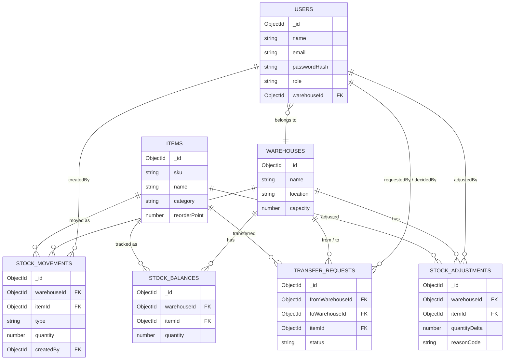

# P11 — Warehouse & Inventory Management System

**Repository:** `warehouse-system`
**Domain:** Supply Chain
**Course:** 5th Semester CIA-3 Project, Christ University

---

## Team Details

| Name                     | Roll No. | Department | Section  |
| ------------------------ | -------: | ---------- | -------- |
| Anamika Manoj            |  2463006 | CSE        | 5 BTCS A |
| Angela Elizabeth Domingo |  2462033 | CSE        | 5 BTCS A |
| Nandana Padmasenan       |  2462117 | CSE        | 5 BTCS C |
| Arya M                   |  2462317 | CSE        | 5 BTCS B |

---

## 1. Problem Statement

Companies operating multiple warehouses struggle to keep an accurate, real-time picture of how much stock they hold, where it is, and how it is moving. Manual tracking across locations can lead to stockouts, overstocking, and the absence of an audit trail when something goes wrong.

This project is a backend Warehouse and Inventory Management System that allows warehouse staff to record stock movements, managers to approve transfers between warehouses, and managers/admins to access reports and low-stock alerts. The system is supported by role-based access control so that each user can access only the features permitted for their role.

---

## 2. Tech Stack Used

* **Runtime:** Node.js (>=18)
* **Framework:** Express.js
* **Database:** MongoDB with Mongoose ODM
* **Authentication:** JSON Web Tokens (JWT) + bcrypt password hashing
* **Validation:** express-validator
* **Documentation / Testing:** Postman Collection (`postman_collection.json`)
* **Development Tools:** nodemon, morgan, dotenv

---

## 3. Setup and Installation Instructions

### Prerequisites

Before running the project, make sure the following are installed:

* Node.js 18 or higher
* npm
* MongoDB

MongoDB can be used in either of the following ways:

* Local MongoDB instance running on `127.0.0.1:27017`, or
* MongoDB Atlas cloud database

---

### Installation Steps

#### Step 1: Clone the repository

```bash
git clone https://github.com/YOUR-USERNAME/warehouse-system.git
```

Replace `YOUR-USERNAME` with the GitHub username of the repository owner.

---

#### Step 2: Open the project folder

```bash
cd warehouse-system
```

---

#### Step 3: Install dependencies

```bash
npm install
```

---

#### Step 4: Configure environment variables

Create a `.env` file using the `.env.example` file.

For Windows Command Prompt:

```bash
copy .env.example .env
```

For PowerShell:

```powershell
Copy-Item .env.example .env
```

Then open the `.env` file and configure:

```env
MONGO_URI=your_mongodb_connection_string
JWT_SECRET=your_secret_key
PORT=5000
```

---

#### Step 5: Start MongoDB

If using a local MongoDB installation, make sure MongoDB is running.

For example:

```bash
mongod
```

If using MongoDB Atlas, ensure that the correct Atlas connection string is added to the `.env` file.

---

#### Step 6: Seed demo data (Optional but Recommended)

```bash
npm run seed
```

This creates:

* 2 warehouses
* 2 inventory items
* 3 demo users

Demo users include:

* Admin
* Manager
* Staff

All demo users use the password:

```text
Password123
```

---

#### Step 7: Start the server

Using nodemon:

```bash
npm run dev
```

Or using Node.js:

```bash
npm start
```

The server starts on:

```text
http://localhost:5000
```

---

## 4. Verifying the Application

Once the server is running, test the health endpoint:

```bash
curl http://localhost:5000/api/health
```

Expected response:

```json
{
  "success": true,
  "message": "API is running"
}
```

---

### Smoke Testing

An optional end-to-end verification script is included in:

```text
smoke-test.js
```

With the server running in one terminal, open another terminal and run:

```bash
node smoke-test.js
```

The smoke test walks through the main system workflow:

```text
User Registration
        ↓
Stock-In
        ↓
Stock-Out
        ↓
Warehouse Transfer
        ↓
Transfer Approval
        ↓
Reports
```

The script displays PASS or FAIL for each step.

---

# 5. List of Implemented Modules

| #  | Module                             | Status | Key Endpoints                                                     |
| -- | ---------------------------------- | ------ | ----------------------------------------------------------------- |
| 1  | User Registration & Authentication | ✅      | `/api/auth/register`, `/api/auth/login`, `/api/auth/me`           |
| 2  | Warehouse Management               | ✅      | `/api/warehouses`                                                 |
| 3  | Item/SKU Master Management         | ✅      | `/api/items`                                                      |
| 4  | Stock-In Recording                 | ✅      | `/api/stock/in`                                                   |
| 5  | Stock-Out Recording                | ✅      | `/api/stock/out`                                                  |
| 6  | Running Stock Balance Engine       | ✅      | `/api/balances`                                                   |
| 7  | Inter-Warehouse Transfer Requests  | ✅      | `/api/transfers`                                                  |
| 8  | Transfer Approval Workflow         | ✅      | `/api/transfers/:id/decision`                                     |
| 9  | Low-Stock Alert & Reorder Point    | ✅      | `/api/items/low-stock`                                            |
| 10 | Stock Audit / Adjustment Module    | ✅      | `/api/adjustments`                                                |
| 11 | Movement History Log               | ✅      | `/api/movements`                                                  |
| 12 | Manager & Admin Reports            | ✅      | `/api/admin/reports/valuation`, `/fast-moving`, `/warehouse-wise` |
| 13 | Role-Based Access Control          | ✅      | Enforced using authentication and RBAC middleware                 |

---

# 6. API Endpoint Reference

All API endpoints are prefixed with:

```text
/api
```

All routes except the registration and login endpoints require:

```text
Authorization: Bearer <token>
```

---

## 6.1 Authentication

| Method | Endpoint         | Role                   | Description                |
| ------ | ---------------- | ---------------------- | -------------------------- |
| POST   | `/auth/register` | Public                 | Register a new user        |
| POST   | `/auth/login`    | Public                 | Log in and receive JWT     |
| GET    | `/auth/me`       | Any Authenticated User | Get current logged-in user |

---

## 6.2 Warehouse Management

| Method | Endpoint          | Role  | Description                |
| ------ | ----------------- | ----- | -------------------------- |
| GET    | `/warehouses`     | Any   | List all warehouses        |
| GET    | `/warehouses/:id` | Any   | Get details of a warehouse |
| POST   | `/warehouses`     | Admin | Create a warehouse         |
| PUT    | `/warehouses/:id` | Admin | Update a warehouse         |
| DELETE | `/warehouses/:id` | Admin | Soft-delete a warehouse    |

---

## 6.3 Item Management

| Method | Endpoint           | Role  | Description                          |
| ------ | ------------------ | ----- | ------------------------------------ |
| GET    | `/items`           | Any   | List all inventory items             |
| GET    | `/items/low-stock` | Any   | View items at or below reorder point |
| GET    | `/items/:id`       | Any   | Get details of one item              |
| POST   | `/items`           | Admin | Create an inventory item             |
| PUT    | `/items/:id`       | Admin | Update an inventory item             |
| DELETE | `/items/:id`       | Admin | Soft-delete an inventory item        |

The items endpoint supports:

```text
?category=
?search=
```

Example:

```text
/api/items?category=Electronics
```

---

## 6.4 Stock Management

| Method | Endpoint                                                       | Role                    | Description                 |
| ------ | -------------------------------------------------------------- | ----------------------- | --------------------------- |
| POST   | `/stock/in`                                                    | Staff / Manager / Admin | Record incoming stock       |
| POST   | `/stock/out`                                                   | Staff / Manager / Admin | Record outgoing stock       |
| GET    | `/balances?warehouseId=&itemId=`                               | Any                     | View current stock balances |
| GET    | `/movements?warehouseId=&itemId=&type=&from=&to=&page=&limit=` | Any                     | View stock movement history |

---

## 6.5 Warehouse Transfers

| Method | Endpoint                          | Role                    | Description                         |
| ------ | --------------------------------- | ----------------------- | ----------------------------------- |
| POST   | `/transfers`                      | Staff / Manager / Admin | Request an inter-warehouse transfer |
| GET    | `/transfers?status=&warehouseId=` | Any                     | List transfer requests              |
| GET    | `/transfers/:id`                  | Any                     | Get a specific transfer request     |
| PUT    | `/transfers/:id/decision`         | Manager / Admin         | Approve or reject a transfer        |

---

## 6.6 Stock Adjustments

| Method | Endpoint                            | Role            | Description                      |
| ------ | ----------------------------------- | --------------- | -------------------------------- |
| POST   | `/adjustments`                      | Manager / Admin | Record a manual stock correction |
| GET    | `/adjustments?warehouseId=&itemId=` | Any             | View stock adjustments           |

---

## 6.7 Reports

The following report endpoints are accessible only to:

* Manager
* Admin

| Method | Endpoint                                      | Description                                            |
| ------ | --------------------------------------------- | ------------------------------------------------------ |
| GET    | `/admin/reports/valuation`                    | View total stock value overall and per warehouse       |
| GET    | `/admin/reports/fast-moving?days=30&limit=10` | View highest stock-out volume within a selected period |
| GET    | `/admin/reports/warehouse-wise`               | View item count and total quantity per warehouse       |

---

## 7. Postman API Testing

The project includes:

```text
postman_collection.json
```

Import this file into Postman to test all API endpoints.

The collection contains:

* Pre-configured API requests
* Example request bodies
* Authentication endpoints
* Warehouse operations
* Item operations
* Stock operations
* Transfer operations
* Adjustment operations
* Report requests

---

# 8. Database Schema Summary

| Collection         | Key Fields                                                              | Description                                |
| ------------------ | ----------------------------------------------------------------------- | ------------------------------------------ |
| `users`            | name, email, passwordHash, role, warehouseId                            | Stores user accounts and role information  |
| `warehouses`       | name, location, capacity, isActive                                      | Stores warehouse details                   |
| `items`            | sku, name, category, unit, unitPrice, reorderPoint, isActive            | Stores inventory item information          |
| `stockBalances`    | warehouseId, itemId, quantity                                           | Stores the current stock quantity          |
| `stockMovements`   | warehouseId, itemId, type, quantity, balanceAfter, reference, createdBy | Stores the complete stock movement history |
| `transferRequests` | fromWarehouseId, toWarehouseId, itemId, quantity, status                | Stores warehouse transfer requests         |
| `stockAdjustments` | warehouseId, itemId, quantityDelta, reasonCode, adjustedBy              | Stores manual stock adjustments            |

---

## Reference vs Embedding Design

The project primarily uses MongoDB references using `ObjectId`.

Warehouses and items are shared across multiple collections, including:

* Stock balances
* Stock movements
* Transfer requests
* Stock adjustments

Therefore, references are used instead of embedding duplicate warehouse and item information in multiple documents.

This reduces unnecessary data duplication and makes updates easier to manage.

---

# 9. Entity Relationship Diagram



GitHub supports Mermaid diagrams directly inside README files.

---

# 10. Role-Based Access Control

| Role                  | Permissions                                                                                                                      |
| --------------------- | -------------------------------------------------------------------------------------------------------------------------------- |
| **Staff**             | Register and login, record stock-in and stock-out, create transfer requests, and view balances, items, movements, and warehouses |
| **Warehouse Manager** | All Staff permissions, plus approve or reject transfers, record stock adjustments, and access reports                            |
| **Admin**             | All Manager permissions, plus create, update, and deactivate warehouses and inventory items                                      |

Role-based access control is enforced using two middleware layers:

### Authentication Middleware

The authentication middleware:

```text
protect
```

Verifies the JWT token and loads the current user.

### Authorization Middleware

The authorization middleware:

```text
authorize(...roles)
```

Checks whether the authenticated user's role has permission to access the requested route.

---

# 11. Business Rules and State-Machine Logic

## 11.1 Running Stock Balance Engine

The file:

```text
utils/stockService.js
```

contains the shared stock management logic.

Every stock increase or decrease goes through the central stock service.

For stock decreases, the system ensures that stock cannot become negative.

If insufficient stock is available, the system returns:

```text
409 Conflict
```

instead of allowing the balance to become negative.

---

## 11.2 Transfer Approval Workflow

A warehouse transfer request follows this workflow:

```text
Pending
   │
   ├──────────────► Approved
   │
   └──────────────► Rejected
```

A request can only be approved or rejected once.

Attempting to modify an already completed request results in:

```text
409 INVALID_STATE_TRANSITION
```

When a transfer is approved:

```text
Source Warehouse
        │
        │ Stock Removed
        ▼
Transfer Processing
        │
        │ Stock Added
        ▼
Destination Warehouse
```

If the destination update fails after stock has been removed from the source warehouse, the system restores the stock to the source warehouse.

This prevents stock from being silently lost.

---

## 11.3 Low Stock Alert

Low-stock status is calculated dynamically.

The system compares:

```text
Current Stock Quantity
        vs
Reorder Point
```

If the stock quantity is at or below the configured reorder point, the item is included in the low-stock results.

---

# 12. Known Limitations

* MongoDB multi-document transactions require a replica set configuration.
* Local standalone MongoDB installations may not support full multi-document transactions.
* Transfer approval therefore uses a compensation mechanism to restore stock if a destination update fails.
* Third-party integrations such as payment gateways, SMS, email, and maps are outside the project scope.
* The project assumes a single currency, locale, and timezone.
* A dedicated frontend interface is not currently included.
* The backend API is demonstrated using the included Postman collection.

---

# 13. Project Folder Structure

```text
warehouse-system/
│
├── config/
│   └── db.js
│
├── controllers/
│   ├── authController.js
│   ├── warehouseController.js
│   ├── itemController.js
│   ├── stockController.js
│   ├── balanceController.js
│   ├── adjustmentController.js
│   ├── movementController.js
│   ├── transferController.js
│   └── reportController.js
│
├── middleware/
│   ├── auth.js
│   ├── rbac.js
│   ├── validate.js
│   └── errorHandler.js
│
├── models/
│   ├── User.js
│   ├── Warehouse.js
│   ├── Item.js
│   ├── StockBalance.js
│   ├── StockMovement.js
│   ├── StockAdjustment.js
│   └── TransferRequest.js
│
├── routes/
│   ├── authRoutes.js
│   ├── warehouseRoutes.js
│   ├── itemRoutes.js
│   ├── stockRoutes.js
│   ├── balanceRoutes.js
│   ├── adjustmentRoutes.js
│   ├── movementRoutes.js
│   ├── transferRoutes.js
│   └── reportRoutes.js
│
├── utils/
│   ├── validators/
│   ├── stockService.js
│   ├── ApiError.js
│   ├── asyncHandler.js
│   ├── generateToken.js
│   ├── constants.js
│   └── seed.js
│
├── postman_collection.json
├── smoke-test.js
├── .env.example
├── .gitignore
├── server.js
├── package.json
├── package-lock.json
└── README.md
```

---

# 14. Deliverables Checklist

* [x] Complete source code
* [x] README.md
* [x] Team details
* [x] Module list
* [x] Setup and installation instructions
* [x] API endpoint documentation
* [x] Postman collection
* [x] Database schema documentation
* [x] Role-based access control
* [x] Project folder structure
* [ ] Code and output screenshots for PDF/PPT
* [ ] PPT presentation
* [ ] Live demonstration or recorded walkthrough

---

## Project Repository

**Repository Name:**

```text
warehouse-system
```

After creating the repository, update the clone command in this README with your actual GitHub username:

```bash
git clone https://github.com/Angela-Domingo/warehouse-system
```
